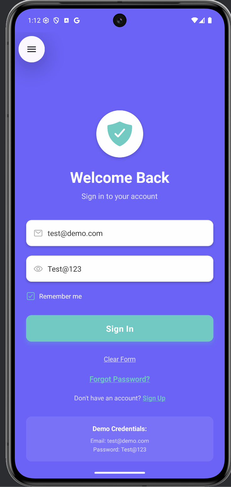
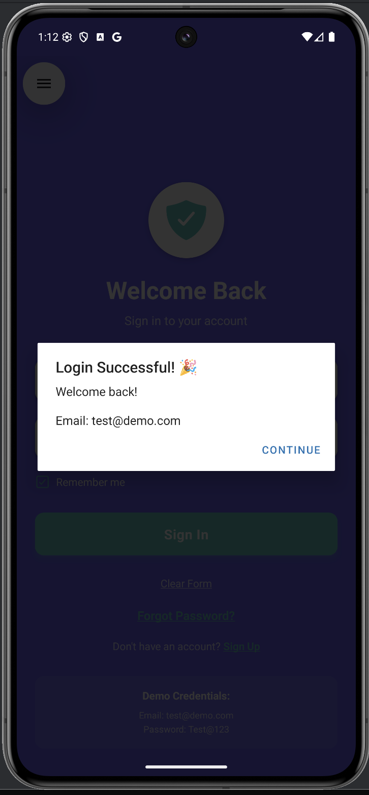
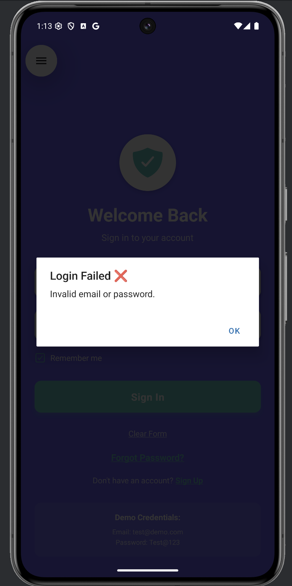
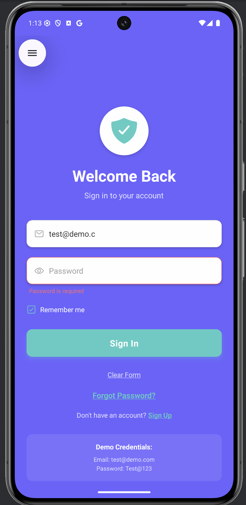
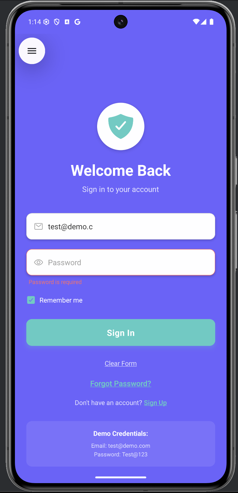
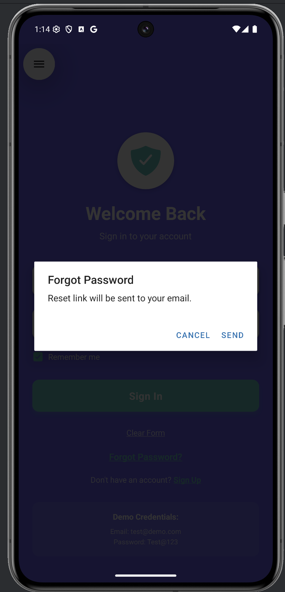
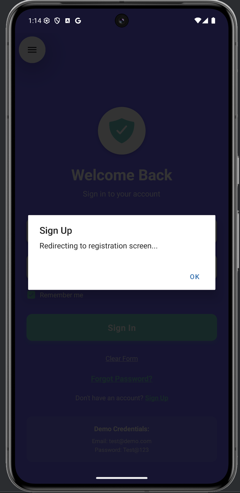

# React Native Login Screen App

A beautifully designed, responsive, and fully functional login screen built using **React Native** and **Expo**.

---

## 🚀 Features

### 🔒 Authentication Features

* Email & Password login
* Secure password field with visibility toggle
* Real-time input validation
* Remember Me functionality

### 🎨 UI/UX Highlights

* Smooth animations (fade-in & slide-in)
* Custom reusable components
* Keyboard-aware layout
* Clear form button
* Stylish design with gradients and shadows

### ✅ Validation Rules

* Email: required, must follow `name@domain.com`
* Password:

  * Required
  * Minimum 6 characters
  * At least 1 uppercase letter
  * At least 1 lowercase letter
  * At least 1 digit

---

## 📁 Project Structure

```
LoginScreenApp/
├── App.js
├── components/
│   ├── LoginScreen.js
│   ├── CustomButton.js
│   └── CustomInput.js
├── data/
│   └── credentials.json
├── utils/
│   └── validation.js
├── assets/  # for images/icons
└── README.md
```

---

## 🛠️ Installation & Setup

### Step 1: Environment Setup

```bash
# Install Node.js from https://nodejs.org
npm install -g expo-cli 
expo --version
```

### Step 2: Create Project

```bash
expo init LoginScreenApp  # Choose "blank (JavaScript)"
cd LoginScreenApp
npm install @expo/vector-icons react-native-vector-icons
```

### Step 3: Run the App

```bash
npm start
# or
expo start
```

### Run on Device/Emulator

* iOS: Press `i`
* Android: Press `a`
* Physical Device: Scan QR code using Expo Go

---

## 🔍 Demo Credentials

| Email                                                         | Password |
| ------------------------------------------------------------- | -------- |
| [sujalpattewar26@gmail.com](mailto:sujalpattewar26@gmail.com) | Sujal123 |
| [admin@example.com](mailto:admin@example.com)                 | Admin123 |
| [test@demo.com](mailto:test@demo.com)                         | Test123  |

---

## 💻 Components

### `App.js`

* Entry point of the app
* Loads `LoginScreen`

### `LoginScreen.js`

* Contains full UI, animations, and logic
* Validates credentials from `credentials.json`

### `CustomInput.js`

* Input field with optional icon, error display, and secure entry

### `CustomButton.js`

* Touchable button with loading spinner and disabled state

### `validation.js`

* Email and password validators with rule-based feedback

---

## ✏️ Customization

### 🎨 Color Palette

* Primary: `#6C63FF`
* Secondary: `#4ECDC4`
* Error: `#FF6B6B`
* Text: `#333333`

### 🔤 Fonts

* Title: 32px, Bold
* Input: 16px, Regular
* Button: 18px, Bold

---

## 📸 Screenshots
<p align="center">
  
  
  
  
  
  
  
  
</p>


## 📦 Deployment

```bash
# Android Build
expo build:android

# iOS Build
expo build:ios
```

---

## 🤝 Contributing

1. Fork this repository
2. Create a new feature branch
3. Commit your changes
4. Push the branch
5. Open a Pull Request

